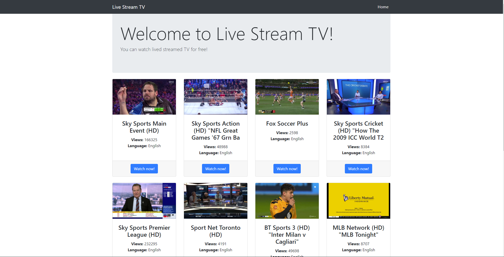
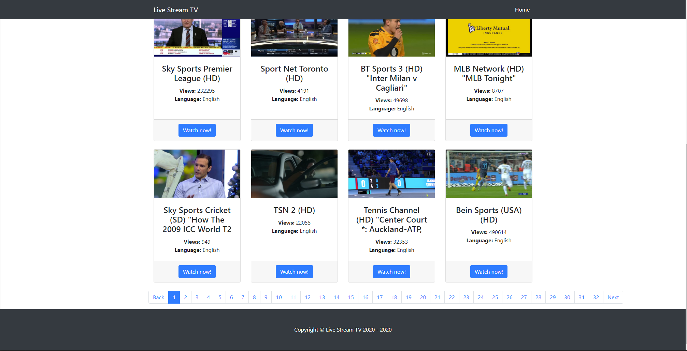

## Live TV Channel Viewer

This simple script displays live TV channels from around the world. (Streamed by other people). All it does is pulls the info from streamlive.to via their XML.

## Demo

Click [here](http://krogtv.net/) for the demo. Please note that this will always be the WIP version. There is no demo of the "stable" version.

## Installation

Simply upload the index.php, and the config.php to any compatible host, and you're ready to go!

## Config

You can modify some options of the script on the config file.

## Why use this, when I can go on streamlive.tv

There are no real benefits to using this, I made this simple script back in 2013 when I had my own "Watch free movies online" website. So it was useful back then. Other than that, you'd probably be better off using steamlive.tv.

## Why update if this is useless?

I was bored... :p

## Version 3.0

I am working on VR 3.0, you'll be able to watch the stream on your website instead of redirecting to Streamlive's website. You can also blacklist channels in case you want to hide the premium channels on your site.
You can take a look at the work I am doing at the [WIP branch](https://gitlab.com/ScaredDonut/live-tv-viewer/tree/WIP).

## Pictures

## Credits

[BlackrockDigital](https://github.com/BlackrockDigital/) - For their [template](https://github.com/BlackrockDigital/startbootstrap-heroic-features)

[StreamLive](https://www.streamlive.to/) - for their API and for making this possible. :)

## License

The MIT License